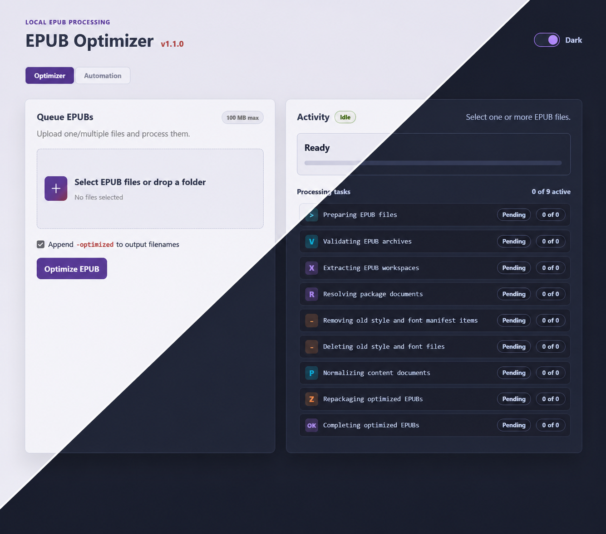

# EPUB Optimizer

A local, Dockerized web app for normalizing EPUB files into a consistent house
style.

EPUB Optimizer accepts one or more `.epub` files, processes them locally, and
returns separate `-optimized.epub` downloads. It is built for predictable,
conservative cleanup rather than aggressive rewriting.



## What It Does

The optimizer extracts each EPUB, rewrites supported XHTML content into a stable
semantic structure, replaces publisher-specific styling with one canonical
stylesheet, and repackages the result as a valid EPUB.

In practical terms, it currently:

- supports EPUB 2 and EPUB 3 archives
- preserves reading order, metadata, navigation files, links, anchors, and image
  resources
- removes old stylesheet and embedded-font manifest entries
- removes old stylesheet/font files when they are no longer needed
- injects a single canonical stylesheet
- normalizes chapter, part, front matter, title page, metadata page, table of
  contents, image, extract, quote, and body paragraph styling
- preserves semantic inline markup such as emphasis, strong text, superscript,
  and subscript
- keeps images as-is without resizing, recompressing, or changing image bytes
- writes the EPUB ZIP with the required uncompressed `mimetype` entry first

The goal is to reduce publisher-specific presentation noise while keeping the
book readable, structurally intact, and compatible with common EPUB readers.

## What It Does Not Do

EPUB Optimizer intentionally does not:

- remove DRM
- rewrite book text
- strip metadata
- optimize, resize, or recompress images
- fetch remote resources
- upload books to a remote service
- overwrite the original EPUB file

Uploaded files are treated as temporary inputs. Optimized files are kept by the
running app container long enough to download them.

## Deploy With Docker Compose

The default Compose file runs the published image from GitHub Container Registry.

```bash
docker compose pull
docker compose up -d
```

Then open:

```text
http://localhost:4200
```

Optimized downloads are stored in the `epub_optimizer_data` Docker volume so
they remain available across container restarts. Uploaded source files and
temporary extraction workspaces are still treated as temporary processing data.

## Build Locally With Docker

For local development or testing without pulling the published image, use the
build override:

```bash
docker compose -f docker-compose.yml -f docker-compose.build.yml up --build
```

Then open:

```text
http://localhost:4200
```

The web UI lets you select one or more EPUB files, process them as a queue, view
batch task progress, and download each optimized EPUB individually or all
optimized files together as a ZIP.

## Published Docker Images

Docker images are built automatically by GitHub Actions.

- Pull requests and pushes to `main` build the image to verify the Docker build.
- Version tags publish the image to GitHub Container Registry.

Release tags should match the Python package version:

```text
pyproject.toml version = 0.1.31
git tag v0.1.31
git push origin v0.1.31
```

Publishing a matching `vX.Y.Z` tag creates exactly two image tags:

```text
ghcr.io/henrybaby/epub-optimizer:X.Y.Z
ghcr.io/henrybaby/epub-optimizer:latest
```

## Local Development

```powershell
python -m venv .venv
.venv\Scripts\Activate.ps1
pip install -e ".[dev]"
python -m pytest
uvicorn epub_optimizer.web:app --reload --port 4200
```

Useful checks:

```powershell
python -m ruff check .
python -m pytest
```

## Project Shape

The application is split into two main layers:

- `epub_optimizer.core` contains the EPUB extraction, normalization, and
  repackaging pipeline.
- `epub_optimizer.web` contains the FastAPI web layer used by the local browser
  GUI.

The core optimizer is kept separate from the GUI so it can later be reused by a
CLI or other batch workflow.
